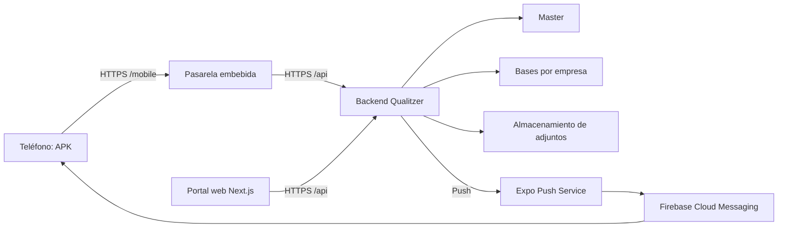

# Manual completo de instalación de Qualitzer técnicos

**Backend, frontend web, Expo, Firebase, APK y puesta en marcha**  
Edición: **11 de septiembre de 2026**. Basado en el trabajo realizado el 10 y 11 de septiembre, en las fuentes y en las comprobaciones registradas.

> Este manual explica cómo repetir el proceso en otro entorno. **No significa que ese entorno ya esté desplegado o certificado.** Los comandos son instrucciones para una ejecución posterior autorizada; redactar este documento no ejecuta migraciones, instala servicios ni cambia credenciales.

## Índice

1. [Entender las piezas y elegir la ruta](#piezas)
2. [Responsables y reglas para trabajar con IA](#responsables)
3. [Ficha del nuevo entorno](#ficha)
4. [Preparar repositorios y servicios](#preparar)
5. [Instalar e integrar el backend](#backend)
6. [Ejecutar las migraciones, por separado](#migraciones)
7. [Configurar pasarela, HTTPS y proceso API](#pasarela)
8. [Instalar el frontend web y preparar al técnico](#frontend)
9. [Crear el proyecto Expo](#expo)
10. [Crear Firebase y registrar Android](#firebase)
11. [Configurar la credencial FCM en Expo](#fcm)
12. [Configurar notificaciones en la API](#push-api)
13. [Preparar y compilar la app móvil](#apk)
14. [Publicar el instalador e instalar en el teléfono](#instalar)
15. [Verificaciones obligatorias y aceptación](#verificar)
16. [Actualizar, trasladar o volver atrás](#actualizar)
17. [Diagnóstico rápido](#diagnostico)
18. [Registro de lo ya hecho y límites](#historial)

<a id="piezas"></a>
## 1. Entender las piezas y elegir la ruta

### 1.1 Qué significa cada nombre

| Pieza | Qué hace | Dónde se instala |
| --- | --- | --- |
| **Backend/API** | Autentica, consulta/guarda trabajos y accede a las bases | Servidor de API |
| **Pasarela móvil / gateway** | Adapta la API para la app y conserva sesiones móviles cifradas | En esta instalación, dentro del mismo backend, ruta `/mobile` |
| **Frontend web** | Portal administrativo: empresas, roles, colaboradores, planificación | Servidor Next.js o plataforma web aprobada |
| **Frontend móvil** | App de los técnicos, proyecto `Qualitzer-Mobile` | Se compila en el equipo de desarrollo; la APK se instala en Android |
| **Master** | Registro de empresas y sus bases/orígenes | MySQL del entorno |
| **Tenant** | Empresa con sus datos separados | Base de datos de esa empresa |
| **Expo/EAS** | Proyecto de la app y credenciales para el servicio push | Cuenta de Expo de la organización |
| **Firebase/FCM** | Entrega de notificaciones Android | Proyecto Firebase de la organización |
| **APK** | Instalador Android firmado | Teléfono; no se “ejecuta” en el backend o frontend web |



**La app no pasa por el frontend web para consultar trabajos.** El portal sirve para administrarlos. Cambiar el portal no actualiza una APK ya instalada. El modo web de Expo tampoco es el portal Next.js.

### 1.2 Tres operaciones que no deben mezclarse

1. **Configuración:** variables y URLs de un proceso. Por ejemplo, `MOBILE_PUSH_ENABLED`.
2. **Migraciones:** cambios de estructura en DB. Por ejemplo, crear `mobile_push_devices`.
3. **Datos funcionales:** crear un colaborador, dar acceso a una sucursal o asignar un trabajo.

Las variables se cargan **una vez por instalación de API**. Las tablas tenant se crean mediante migraciones **en cada base afectada**. No hay que escribir nombres de tablas en la configuración ni crear un proyecto Firebase por empresa.

### 1.3 Elegir antes de empezar

| Caso | Ruta correcta |
| --- | --- |
| API/portal existentes; añadir la app | Conservar sus servicios, integrar módulos móviles, revisar migraciones pendientes y configurar `/mobile` |
| Actualizar sólo la APK en el mismo entorno | Conservar paquete, firma y URL; incrementar versión/código; no repetir altas ni migraciones sin cambios |
| Instalar un entorno vacío | Preparar master/tenants, servicios base, portal y app; revisar seeders antes de autorizar |
| Producción y pruebas deben coexistir en un teléfono | Preferir identificadores Android distintos y proyectos/datos aislados; requiere adaptar las políticas del compilador |
| Sustituir un entorno anterior con la misma app | Planificar la transición: finalizar pendientes del anterior y resolver compatibilidad de sesión/caché antes de instalar |

**Cambiar la URL compilada no migra sesiones, caché ni pendientes.** El cliente comprueba identidad y destino; no borrar su almacenamiento para superar una incompatibilidad. Si se usa otro paquete, Android lo trata como otra aplicación y no transfiere sus datos automáticamente.

<a id="responsables"></a>
## 2. Responsables y reglas para trabajar con IA

Usaremos tres etiquetas:

- **PERSONA:** acciones de propietario/administrador: login, MFA, aceptar condiciones, aprobar dominios, introducir secretos, permisos del teléfono y autorización del pase.
- **IA:** revisar fuentes, preparar configuración sin secretos, adaptar scripts, compilar cuando se autorice, inspeccionar artefactos y documentar evidencias.
- **PERSONA + IA:** la IA propone un plan acotado; la persona aprueba el entorno, los datos y las acciones con efectos.

### 2.1 Reglas obligatorias

- No pegar claves privadas, contraseñas, tokens, cookies, archivos completos de entorno ni HAR autenticados en el chat.
- La IA puede trabajar con **rutas** a archivos privados mediante herramientas locales autorizadas, pero no debe leerlos al chat, copiarlos a código ni imprimirlos.
- No generar/rotar la firma Android por un error de compilación. No confundirla con Firebase.
- Para producción, usar secretos nuevos o previamente controlados. Las credenciales expuestas durante pruebas no deben promoverse sin revisión y rotación supervisada.
- Nunca ejecutar un deploy que haga reset forzado, migraciones globales o reinicios sin revisar sus efectos y el entorno real.
- No eliminar pendientes, archivos cifrados, recibos, filas de migraciones o locks para “hacer que funcione”.
- Instalar, migrar, enviar correo, cambiar IAM, subir una credencial, registrar un dispositivo y reiniciar servicios son acciones con efectos: deben estar autorizadas por fase.
- Las pruebas de navegador, emulador y teléfono son evidencias diferentes. No declarar push entregado por tener un proyecto creado o un ticket aceptado.

### 2.2 Prompt inicial para la IA

> Necesito preparar Qualitzer técnicos para el entorno definido en la ficha adjunta. Trabaja sobre los repositorios existentes; no crees otra app ni cambies ramas. Primero inspecciona código, scripts, versiones, módulos, migraciones y configuración pública. Separa backend, frontend web, frontend móvil, variables y migraciones. No leas secretos al chat ni ejecutes SQL, instalaciones, builds, cambios remotos o reinicios todavía. Devuelve un plan en español con archivos concretos, comandos, efecto, responsable, verificación y reversión. Marca los datos que faltan y los límites reales; no uses los valores de pruebas como producción.

**Resultado esperado:** un plan revisable, no una lista de operaciones que ya se hayan ejecutado.

<a id="ficha"></a>
## 3. Completar la ficha del nuevo entorno

**PERSONA.** Copiar y completar [PLANTILLA-PASE-ENTORNO.md](PLANTILLA-PASE-ENTORNO.md). Guardar sólo identificadores públicos y referencias al almacén de secretos, no los secretos.

Datos indispensables:

| Dato | Ejemplo ficticio — reemplazar |
| --- | --- |
| Nombre de entorno | producción / staging |
| API pública | `https://api.example.com/api` |
| Pasarela pública para la APK | `https://api.example.com/mobile` |
| Portal web por empresa | `https://empresa.example.com` |
| Usuario/grupo Linux y proceso API | Nombres reales comprobados, no copiados de una captura |
| Directorio persistente de sesiones | `/var/lib/qualitzer-mobile-prod` |
| Master y empresas piloto | Nombres reales de DB, fuera de mensajes públicos |
| Identificador Android | Paquete aprobado para ese canal; conservar el existente para actualizar |
| Propietario/proyecto Expo | Organización, slug y Project ID real |
| Proyecto Firebase | ID, aplicación Android y número de remitente públicos |
| Firma | Ubicación de respaldo privado y huella pública; nunca contraseña |
| Canal de entrega | Descarga HTTPS, distribución interna/MDM o tienda |

**Punto de control:** no hay que tener 100 proyectos Expo si hay 100 empresas. Sin embargo, el catálogo móvil actual limita el descubrimiento a **50 empresas activas**; para más, la IA debe proponer y verificar un cambio específico antes de dar por soportado el entorno. Las migraciones y ese límite son asuntos distintos.

### Identificadores que suelen confundirse

| Nombre | Ejemplo/tipo | Dónde se obtiene |
| --- | --- | --- |
| Android application identifier | `com.qualitzer.field` en la distribución actual | Lo define la aplicación; se **escribe** en Expo/Firebase |
| Expo Project ID | UUID con guiones | Expo → proyecto → Project settings → General |
| Slug Expo | `qualitzer-tecnicos` en pruebas | Proyecto Expo; debe coincidir con la configuración local |
| Firebase Project ID | Nombre técnico del proyecto | Firebase → Configuración del proyecto |
| Firebase project number / sender ID | Número | Mismo proyecto Firebase |
| `MOBILE_PUSH_ENCRYPTION_KEY` | Secreto de 64 caracteres hexadecimales | Se genera privadamente para la API; no viene de Expo |
| `MOBILE_PUSH_GATEWAY_USER_AGENT` | Texto fijo acordado | `Qualitzer-Mobile/1.0 (Mobile; Gateway)` |
| FCM v1 service account key | JSON **privado** con clave de cuenta de servicio | Firebase/Google Cloud; se asocia en Expo, no en el APK |
| Android upload keystore | Archivo de firma y contraseñas | Custodio de la firma; **no es el JSON Firebase** |

<a id="preparar"></a>
## 4. Preparar repositorios, equipo y servicios base

### 4.1 Código existente, no proyecto nuevo

**IA:** identificar revisiones aprobadas de Backend, Frontend y Mobile; revisar cambios locales y preservar todo trabajo ajeno. No deducir la rama de producción por el nombre de una carpeta. Obtener una entrega reproducible con manifiestos y locks.

**PERSONA:** suministrar acceso al servidor, DNS, base de datos y almacenamiento mediante mecanismos privados. No entregar sus contraseñas al chat.

Requisitos observados — revisar soporte vigente antes de producción:

| Componente | Contrato actual |
| --- | --- |
| Backend | Node 20.12.2, MySQL 8.0, TypeScript/Express/Sequelize; Redis y servicios base según configuración |
| Portal web | Node 20.12.2, Next 14.2.5, npm con lockfile |
| Mobile | Expo 57, React Native 0.86.3, Node mínimo 22.13; Node local probado 22.23.2 |
| Android | Android 7+; SDK/target 36; JDK 17; toolchain detallada en la fase de build |

No cambiar el Node global del backend para poder compilar Mobile. Usar versiones por proyecto. No desplegar versiones antiguas sólo porque este documento las enumera: realizar revisión de seguridad/compatibilidad separada.

### 4.2 Base existente o vacía

- **Existente:** respaldar, registrar esquema actual y aplicar únicamente lo pendiente. No ejecutar asistentes de alta ni seeders de ejemplo.
- **Vacía:** el backend dispone de `init:tenancy` y `add:tenant`; revisar las preguntas y efectos descritos en la [guía backend](../../Qualitzer2.0-Backend/docs/INSTALACION-APP-TECNICOS.md). El asistente inicial también carga datos en master; no usarlo como comando de mantenimiento.

**Prompt IA:**

> Audita la entrega antes de instalar. Confirma manifiestos/locks, versión de Node, dependencias locales entre repositorios, archivos faltantes, variables por nombre y servicios externos usados al arrancar. No imprimas sus valores. Si el entorno está vacío, propón el alta controlada y qué seeders se necesitan, sin ejecutarlos. Si existe, prohíbe recrear bases o usuarios por rutina.

<a id="backend"></a>
## 5. Instalar e integrar el backend

**Guía detallada y comandos:** [Backend — instalación de la app](../../Qualitzer2.0-Backend/docs/INSTALACION-APP-TECNICOS.md).

### 5.1 Secuencia

1. **IA:** comprobar módulos de autenticación móvil, panel técnico, creación/sync, notificaciones y fachada `mobileGateway` en la entrega. No basta con una carpeta `build` antigua.
2. **IA:** comprobar montaje `/mobile` antes del parser/CORS/autenticación legacy y cierre seguro. El listener debe estar operativo antes de que el gateway consulte el catálogo de la misma API.
3. **PERSONA:** aprobar el paquete gateway y su SHA-256. Mantener la versión anterior disponible para reversión.
4. **IA autorizada:** copiar el tarball versionado a infraestructura del backend y actualizar la dependencia local y el lock. **No copiar el proyecto Mobile ni sus secretos al servidor.**
5. **IA autorizada:** instalar dependencias de la entrega en una carpeta controlada, con la versión de Node aprobada. No tocar el proceso activo mientras usa los archivos que se sustituyen.
6. **PERSONA + IA:** verificar servicios base, configuración y esquema antes de habilitar tráfico.

El gateway 1.0.1 fue entregado para corregir la marca por sucursal. No es necesario regenerarlo sólo por cambiar el dominio backend de una nueva instalación si el código permanece compatible: se configura en el host. Si cambia su código, empaquetar otra versión.

### 5.2 Advertencia del paquete generado

[scripts/pack-mobile-gateway.cjs](../scripts/pack-mobile-gateway.cjs) construye dos veces, compara y genera un tarball inmutable. Incluye documentación/manifiesto de fuentes: incluso un cambio documental incluido puede cambiar su hash. **Si un archivo versionado ya existe con bytes distintos, no borrarlo ni sobrescribirlo para superar el error.** Revisar versión nueva o recuperar las fuentes exactas para reproducción.

**Resultado esperado:** dependencia instalada correcta, fachada integrada y configuración lista; todavía no implica que el esquema o el login funcionen.

<a id="migraciones"></a>
## 6. Ejecutar las migraciones — operación de base de datos

**PERSONA + IA, con autorización específica de DB.** Esta fase no consiste en editar variables.

Las tres migraciones móviles originales son:

| Archivo | Estructura principal |
| --- | --- |
| `20260908160000-Create-MobileCreationRequests.js` | `mobile_creation_requests` |
| `20260908160000-Create-MobileNotifications.js` | `mobile_push_devices`, `mobile_push_snapshots`, `mobile_push_deliveries` |
| `20260909120000-Create-MobileSyncReceipts.js` | `mobile_sync_receipts` |

1. Revisar pendientes del master y de cada base tenant objetivo, con las dependencias anteriores de la entrega.
2. Respaldar y comprobar restauración en un entorno aislado.
3. Aplicar primero en staging y un tenant piloto según el plan aprobado.
4. Verificar `SequelizeMeta`, tablas, columnas e índices. Un fallo DDL puede ser parcial en MySQL.
5. Ampliar por lotes al conjunto aprobado, dejando un resultado por base. No ejecutar 100 veces SQL manual ni aplicar todos los tenants inadvertidamente.
6. Sólo al terminar, marcar la fase completada en la ficha y permitir `MOBILE_PUSH_SCHEMA_READY=true` en la fase de configuración push.

Comando de **aplicación**, desde backend en Bash/Linux y después de revisión:

```bash
npm run tenancy:migrate -- --database NOMBRE_REAL_BASE_TENANT
```

**Ejecuta todas las migraciones pendientes de esa base.** Sin `--database`, el runner recorre todos los tenants registrados, incluso si no son el conjunto activo del cron. No existe un “dry-run” implícito. Para inspección estrictamente sin escrituras, consultar `INFORMATION_SCHEMA` y el historial existente con permisos de lectura. `db:migrate:status`, detallado en la guía backend, no aplica migraciones funcionales, pero puede crear `SequelizeMeta` si falta; exige autorización para ese efecto.

El runner actual puede capturar un fallo sin retornar un código de error distinto de cero. **La IA debe comprobar resultados y esquema, no sólo decir “el comando terminó”.** No eliminar filas del historial ni ejecutar undo masivo.

**Prompt IA:**

> Enumera, sin escribir en DB, las migraciones pendientes del master y del conjunto de tenants aprobado, comparando archivos con metadatos mediante SELECT autorizados; no uses un CLI que inicialice su tabla de historial bajo esta autorización. Señala exactamente qué hace cada runner y si filtra activos. Separa consulta de aplicación. Prepara un lote con validación por base y parada ante fallo; no ejecutes ninguna migración hasta mi aprobación. Después de ejecutar las autorizadas, verifica columnas/índices e historial y registra cada fallo parcial sin borrar datos ni metadatos.

<a id="pasarela"></a>
## 7. Configurar pasarela, HTTPS y proceso API

### 7.1 Elegir dónde cargar variables

**PERSONA + IA:** revisar el proveedor real, no adivinarlo por `NODE_ENV`.

| Tipo | Lectura actual |
| --- | --- |
| Variables `MOBILE_GATEWAY_*` | Proveedor de entorno backend: local con `USE_ENV=development`; AWS con otros valores |
| Variables `MOBILE_PUSH_*`, `EXPO_PROJECT_ID`, `EXPO_ACCESS_TOKEN` | `process.env` directamente en el módulo push revisado |
| Variables `NEXT_PUBLIC_*` | Configuración pública del portal, principalmente incorporada al build |
| Configuración Expo/Firebase móvil | Configuración local revisada y recursos incorporados a la APK |

No cambiar `USE_ENV` para resolver una sola variable: podría cambiar la fuente de configuración de toda la API. Si los secretos push están en AWS, el despliegue debe **inyectarlos al entorno del proceso**; agregarlos únicamente al secreto no basta para ese módulo.

### 7.2 Datos de pasarela

| Variable | Configurar |
| --- | --- |
| `MOBILE_GATEWAY_ENABLED` | `true` al completar requisitos de la fachada |
| `MOBILE_GATEWAY_BACKEND_URL` | URL real HTTPS de la API, terminada en `/api` |
| `MOBILE_GATEWAY_SESSION_FILE` | Ruta absoluta privada y persistente fuera del código desplegable |
| `MOBILE_GATEWAY_TRUSTED_PROXIES` | IPs reales del peer proxy que ve Node, no IP del teléfono |
| `MOBILE_GATEWAY_CORS_ORIGINS` | Cadena vacía para APK nativo; la publicación web de Mobile necesita revisión adicional de cookies y seguridad |

**PERSONA, AWS si corresponde:** consola AWS → región correcta → Secrets Manager → secreto que usa esa API → Retrieve secret value/Obtener valor → Editar → añadir claves sin reemplazar otras → Guardar. No mostrar esa pantalla a la IA ni hacer capturas del valor. Usar strings, incluido CORS `""`; no `null` ni array. La persona responsable del despliegue asegura que el proceso recibe lo que cada módulo necesita.

**Este recorrido distribuye una APK, no el cliente web de Expo.** En el gateway actual, la cookie web usa `Path=/api` y no acompaña automáticamente peticiones al montaje `/mobile/api`. Habilitar un origin no basta. Una distribución web Mobile requiere una adaptación y prueba separadas de cookies, CORS, CSRF y cierre/restauración de sesión. El portal Next no necesita pasar por esa cookie del gateway.

### 7.3 Sesiones persistentes

Crear el directorio mediante el administrador Linux con propietario del proceso API, permiso 0700 y archivos privados 0600. La guía backend contiene los comandos con marcadores.

- No usar el usuario de la aplicación como dueño Linux: son identidades diferentes.
- No colocar la carpeta bajo repositorio, carpeta web pública o un release que vaya a eliminarse.
- No copiar sesiones de pruebas a producción ni usar la misma carpeta entre instalaciones.
- Respaldar clave y snapshot juntos y de forma protegida. El gateway embebido gestiona su clave; no inventar otra.
- Un lock no es basura: verificar al propietario antes de cualquier recuperación manual.

### 7.4 DNS, proxy y arranque

**PERSONA:** DNS → registrar dominio API del nuevo entorno; configurar certificado HTTPS válido según la infraestructura existente. **IA:** proponer el bloque proxy concreto y comprobar la cadena, sin inventar puertos/IPs.

La ruta `/mobile` debe llegar al mismo backend **conservando el prefijo**. No añadir una barra final a `proxy_pass` si elimina `/mobile`; no enviar esas peticiones al portal Next. Conservar `/api` y el resto de rutas preexistentes.

Proceso API: **una instancia, modo fork, sin recarga solapada**, `kill_timeout` 40000 y cierre seguro registrado. Usar **detener → comprobar salida completa → iniciar**. No crear otro servidor API sólo para móviles ni abrir 8787/8081 al público.

### 7.5 Comprobar sin credenciales

Después del arranque aprobado, reemplazar dominio y hacer GET:

```bash
curl --fail --silent --show-error --max-time 30 https://api.example.com/api/auth/mobile/config
curl --include --max-time 30 https://api.example.com/mobile/health
curl --include --max-time 30 https://api.example.com/mobile/api/auth/me
```

**Esperado:** catálogo JSON versión 1; health 200 con `ok` y `backendReachable`; `/me` sin sesión responde **401**. Ese 401 es correcto. No desactivar autenticación, TLS o CORS. El servidor debe poder acceder a su propio catálogo público para iniciar la pasarela.

<a id="frontend"></a>
## 8. Instalar el frontend web y preparar al técnico

**Guía detallada, con rutas y controles comprobados:** [Frontend web — instalación y administración](../../Qualitzer2.0-Frontend/docs/INSTALACION-APP-TECNICOS.md).

### 8.1 Desplegar el portal

1. **IA:** revisar Next, Node, lock, rutas de servidor y variables realmente usadas.
2. **PERSONA:** aprobar dominio frontend, origen tenant y URL API del mismo entorno.
3. **IA autorizada:** configurar la base pública y el prefijo **antes** de compilar. El cliente concatena literalmente `NEXT_PUBLIC_REST_API_URL` y `NEXT_PUBLIC_API_PREFIX`.
4. Instalar dependencias y compilar en una nueva entrega; no usar `next dev` en producción.
5. Publicar Next detrás de HTTPS con un supervisor separado del backend; conservar rutas propias de Next como `/api/manifest`.
6. Comprobar login, API, imágenes, CORS y Socket.IO. No poner claves Firebase Admin, firma, DB ni push en variables `NEXT_PUBLIC_*`.

Ejemplo **público**: base `https://api.example.com`, prefijo `/api`. Resultado `https://api.example.com/api`, **no** `/mobile`. Cambiar esas variables después del build requiere recompilar el portal. Instalar la APK no recompila el portal.

<a id="administracion-web"></a>
### 8.2 Clics administrativos principales

**PERSONA administradora**, dentro del tenant correcto; las opciones dependen de sus permisos:

1. Abrir el portal aprobado → iniciar sesión personalmente → seleccionar sucursal.
2. **Sucursales** (`/es/branches`) → buscar existente → lápiz **Editar sucursal** → **Logotipo** y **Razón social** → desplegar **Configuración regional** → **Zona horaria** → **Guardar cambios**. Reabrir y comprobar persistencia.
3. **Roles** (`/es/role`) → editar rol aprobado → **Datos del rol → ¿Es técnico?** → revisar **Permisos de módulos** y **Permisos de gestión** → guardar. No dar todos los permisos para resolver un fallo.
4. **Usuarios y colaboradores** (`/es/users`) → buscar persona antes de crear → **Editar colaborador** o **Nuevo colaborador** autorizado → **Contacto y dirección** para correo → **Información laboral** para planificación → **Acceso y permisos**.
5. **Roles asociados → Agregar rol** → elegir el rol → **Sucursales con acceso** → seleccionar sólo las aprobadas. Para un alta, **Guardar y enviar credenciales** envía correo y requiere autorización. Si la cuenta ya tiene acceso, guardar los cambios con **Guardar avance**; **Reenviar credenciales no sustituye ese guardado**. No duplicar la persona en otro módulo si falta su vínculo.
6. Comprobar colaborador habilitado, acceso configurado y vínculo de usuario con trabajador. La opción **Es planificable** no equivale a **¿Es técnico?** del rol.
7. **Trabajos** (`/es/works`) permite preparar un trabajo estándar piloto. Seguir el [recorrido completo de veinte pasos verificados](../../Qualitzer2.0-Frontend/docs/INSTALACION-APP-TECNICOS.md#piloto-standard-work): creación, equipo, responsables, lista existente, guardado y agenda. Para mantenimiento, usar su asistente autorizado; no inventar el vínculo del hijo con una OT.
8. Reabrir el trabajo y confirmar el responsable, horario y checklist asociados. El técnico debe encontrarlo luego en la misma sucursal/fecha de la APK.

Las etiquetas anteriores se verificaron en fuentes. Si el tenant desplegado utiliza otra revisión, idioma o permisos, la IA debe contrastar pantalla/código y adaptar las instrucciones, **no inventar controles**.

### 8.3 Marca y acceso del teléfono

El gateway 1.0.1 resuelve el nombre/logo de la sucursal autorizada. En Android, el icono principal sigue siendo Qualitzer técnicos; el acceso empresarial es un shortcut cuya creación pide confirmación del sistema. No confundirlo con la instalación PWA del portal web.

<a id="expo"></a>
## 9. Crear o seleccionar el proyecto Expo

### 9.1 Persona: panel web

1. Abrir [expo.dev](https://expo.dev/).
2. Pulsar **Sign up** si no existe cuenta o **Log in** si ya existe. Completar contraseña/MFA directamente en Expo, no en el chat.
3. Seleccionar la **organización propietaria** del entorno, no una cuenta personal por accidente.
4. En proyectos, pulsar **Create a project/New project** si se necesita uno nuevo; para actualizar el mismo canal, abrir el existente.
5. Escribir nombre y slug aprobados. Registrar ambos en la ficha.
6. En la ventana **Successfully created project**, elegir **For an existing codebase**. **No ejecutar `create-expo-app`**: ya existe el código de Mobile.
7. Copiar únicamente el **Project ID**. Puede aparecer después de `eas init --id` o en **Project settings → General**. Ese UUID es público.
8. Entregar a la IA: organización, slug, Project ID, paquete Android y URL móvil de destino. No entregar contraseña ni token de cuenta.

### 9.2 IA: vinculación comprobada

La IA configura y contrasta `extra.eas.projectId`, slug y paquete. En el caso actual se usa configuración estática en [app.json](../app.json); [app.config.ts](../app.config.ts) aplica el resto de políticas. No ejecutar init si ya está vinculado al proyecto correcto, ni aceptar automáticamente reemplazar el existente.

Para acceso administrativo de la herramienta, usar la versión oficial de EAS CLI aprobada. **24.3.0 fue la usada en esta preparación**, no asumir que cualquier versión futura tiene las mismas API internas.

Ejemplo **PowerShell en Mobile**, después de aprobar descarga de la herramienta y con Node compatible en PATH:

```powershell
$env:EXPO_NO_DOTENV = '1'
npx --yes eas-cli@24.3.0 login --browser
```

La persona completa la ventana de Expo y autoriza EAS CLI. Si aparece **Authentication successful**, vuelve a VS Code; no pega cookies ni códigos en el chat.

```powershell
npx --yes eas-cli@24.3.0 whoami
npx --yes eas-cli@24.3.0 project:info
```

**Esperado:** cuenta/organización, slug y UUID coinciden con la ficha. Si no coinciden, detenerse antes de modificar credenciales. En Windows se utilizó Node propio y npm CLI explícito cuando el PATH global invocaba otra versión; pedir a la IA que localice esas herramientas, no copiar rutas de otro computador.

**Entorno de la terminal:** `EXPO_NO_DOTENV=1` evita cargar dotenv, pero no elimina variables heredadas. Antes de consultar un proyecto o abrir credenciales, la IA debe revisar los overrides públicos `EXPO_PROJECT_ID`, `GOOGLE_SERVICES_FILE`, `EAS_BUILD_PROFILE`, `EXPO_PUBLIC_STANDALONE`, `EXPO_PUBLIC_GATEWAY_URL` y `QUALITZER_BRAND_FILE`. Omitir overrides innecesarios o hacerlos coincidir con la ficha, sólo en ese proceso; no conservar valores de pruebas ni sustituir el entorno del servidor. Si la configuración estática ya tiene el UUID correcto, `EXPO_PROJECT_ID` no es obligatorio para el build/CLI móvil.

**Prompt IA:**

> Vincula únicamente el código Mobile existente al proyecto Expo de la ficha. Comprueba organización, slug, UUID y paquete antes de escribir. Usa el login por navegador para que introduzca yo mis credenciales. No ejecutes create-expo-app, no crees un proyecto remoto duplicado ni cambies la firma. Verifica project:info y la configuración resuelta sin imprimir secretos. Si una política está fijada al entorno de pruebas, propón su adaptación explícita.

<a id="firebase"></a>
## 10. Crear Firebase y registrar Android

### 10.1 Persona: proyecto y cliente Android

1. Abrir [Firebase Console](https://console.firebase.google.com/) con la cuenta/organización aprobada.
2. Pulsar **Crear un proyecto/Add project**, o seleccionar un proyecto existente aprobado para ese entorno.
3. Escribir nombre; revisar el **Project ID** antes de crear. La elección de Google Analytics depende de la política de la organización; **no es requisito de FCM**.
4. Abrir el proyecto → **Añadir aplicación/Add app → Android**.
5. En **Android package name/Nombre del paquete**, **escribir** el identificador exacto de la ficha. No debe aparecer previamente en una lista. Para actualizar la distribución actual: `com.qualitzer.field`.
6. Añadir un sobrenombre descriptivo si se desea. Si solicita SHA de certificado, usar la huella pública de la firma de distribución que valide la IA; no subir el keystore ni su contraseña. Para apps publicadas mediante Play App Signing, distinguir el certificado que realmente firma la app instalada del de subida.
7. Pulsar **Register app/Registrar aplicación**.
8. Pulsar **Download google-services.json** y guardar el archivo en el computador. Este es el **archivo del cliente Android**. No descargar Firebase Admin para incorporarlo a la app.
9. Los pasos de Gradle del asistente genérico no se copian a mano sobre el proyecto Expo. La IA hará la integración mediante configuración/prebuild. Terminar con **Continue to console** cuando corresponda.
10. Entregar a la IA **la ruta local** de esa configuración y los identificadores públicos; no publicar valores de claves innecesariamente.

### 10.2 IA: validar el archivo y no cambiar la app equivocada

Comprobar JSON válido, cliente Android exacto, proyecto Firebase y número de remitente. Rechazar un archivo cuyo tipo sea `service_account` o contenga clave privada. El archivo público del cliente se referencia en `android.googleServicesFile`; no se añade a la API como secreto de push.

La configuración de cliente se incorpora al binario; sustituir un archivo en el servidor **no cambia el APK instalado**. Una API key de cliente Firebase no equivale a una clave privada de administración, pero debe tener las restricciones adecuadas a la app/APIs usadas. No abrir Firebase DB/Storage al público para hacer funcionar FCM; este flujo no necesita crear Firestore.

**Prompt IA:**

> Valida el archivo Android Firebase de la ruta que indico sin imprimir su contenido. Confirma paquete, proyecto, app ID y sender ID contra la ficha. Incorpora sólo la configuración pública al Mobile existente. No aceptes Firebase Admin/service_account como archivo del cliente. Conserva firma, datos y URL aprobada. Prepara pruebas de configuración y de recursos dentro del APK; no declares notificaciones recibidas sólo por compilar.

<a id="fcm"></a>
## 11. Configurar la credencial FCM v1 en Expo

Esta es **otra credencial**, distinta del archivo cliente y de la firma Android.

### 11.1 Persona: cuenta de servicio y clave privada

1. En Firebase, seleccionar el proyecto correcto.
2. Pulsar engranaje → **Project settings/Configuración del proyecto → Service accounts/Cuentas de servicio**.
3. Revisar la cuenta destinada a enviar push y su alcance. En Google Cloud, **IAM y administración → IAM**, el administrador debe verificar el rol necesario **Firebase Cloud Messaging API Admin**. No dar Owner/Editor sólo para evitar un error.
4. Si no existe una clave válida aprobada, pulsar **Generate new private key/Generar nueva clave privada** y confirmar. Guardar el JSON en un almacén/local privado fuera de repositorios, carpetas públicas y artefactos de APK.
5. **No adjuntar este archivo al chat.** Si se comparte accidentalmente, tratarlo como expuesto y coordinar su revocación/sustitución; borrar el mensaje o renombrar el archivo no revoca la clave.

No revocar cuentas completas ni otras claves para sustituir una sola. No usar credenciales expuestas de las pruebas para producción. Registrar responsable de custodia, acceso y futura rotación.

### 11.2 Ruta web si el identificador ya existe

1. Expo → organización → proyecto → **Project settings → Credentials**.
2. En **Android**, seleccionar el **Application identifier** de la ficha.
3. En **Service Credentials → FCM V1 service account key**, pulsar **Add a service account key**.
4. Elegir **Upload new key**, seleccionar privadamente el JSON de cuenta de servicio y **Save**.
5. Confirmar que la asociación corresponde al proyecto Firebase y paquete correctos. No compartir el contenido de la clave como evidencia; bastan estado e identificadores públicos saneados.

### 11.3 Si Expo pide «Android upload keystore»

Éste fue el bloqueo encontrado durante la instalación:

1. Al crear **New application identifier**, escribir el paquete en **Application identifier** y pulsar **Next**.
2. Si el paso siguiente exige **Android upload keystore**, contraseña y alias, **detener ese asistente**. No subir el JSON Firebase allí.
3. No generar una firma nueva ni publicar la firma existente para superar esa pantalla. Las notificaciones pueden administrarse por separado mediante EAS CLI.

### 11.4 Ruta CLI: sólo notificaciones

**IA**, con autorización específica de lectura/asociación de la credencial, desde Mobile y con la sesión Expo ya autorizada:

```powershell
$env:EXPO_NO_DOTENV = '1'
npx --yes eas-cli@24.3.0 credentials --platform android
```

Responder los menús, **uno por uno**, según lo que realmente muestre la versión instalada:

1. Elegir el perfil aprobado de esta app (por ejemplo `standalone-apk`); leer el proyecto/paquete antes de continuar. Elegir un perfil en este gestor no inicia por sí solo un build.
2. En **What do you want to do?**, elegir **Google Service Account**.
3. Elegir **Manage your Google Service Account Key for Push Notifications (FCM V1)**.
4. Elegir **Set up a Google Service Account Key for Push Notifications (FCM V1)**.
5. Elegir una clave existente únicamente si corresponde al proyecto y autorización de la ficha; si no existe, **Upload a new service account key**.
6. Cuando pida la ruta, proporcionar el archivo privado mediante el mecanismo local autorizado. No imprimir el JSON, claves ni contraseñas.
7. Confirmar asociación; volver a consultar para comprobarla. No seleccionar **Keystore**, **Push Notifications (Legacy)** ni credenciales de publicación en Google Play.

**Si la terminal no permite controlar esos menús:** pedir a la IA una operación acotada `plan → apply → nueva consulta`, reutilizando la herramienta oficial instalada. No simular éxito ni repetir una subida incierta a ciegas.

En este proyecto existe [configure-expo-fcm.cjs](../scripts/android/configure-expo-fcm.cjs), utilizado para ese caso. **No es una herramienta genérica lista para cualquier entorno**: fija organización, proyecto, cuenta de servicio, paquete y necesita un informe/APK previo. Su modo `plan` consulta sin asociar; **`apply` sube/asocia remotamente**, no es un dry-run. La IA debe adaptar y revisar sus restricciones antes de usarlo en otro entorno, sin desactivar las comprobaciones de destino/firma. Una clave distinta ya asignada exige revisión, no reemplazo automático.

**Prompt IA:**

> Configura únicamente FCM v1 del proyecto Expo aprobado usando la cuenta autorizada y la ruta privada suministrada. Primero verifica cuenta, organización, UUID, paquete, proyecto Firebase y asociaciones existentes. Presenta un plan sin mutaciones. Tras mi autorización de apply, usa el archivo directamente sin imprimirlo ni copiarlo al repo. No crees, subas, descargues o sustituyas keystores; no toques credenciales de publicación ni otras apps. Si hay una credencial diferente o un resultado incierto, detente. Reconsulta remotamente y demuestra asociación y ausencia de cambios de firma. No envíes notificaciones sin una prueba autorizada.

**Resultado esperado:** credencial FCM v1 asociada. Eso **no equivale** a permiso Android concedido, API habilitada ni mensaje recibido.

<a id="push-api"></a>
## 12. Configurar notificaciones en la API — variables, no migraciones

**PERSONA responsable del servidor**, después de la fase de migraciones y de preparar Expo/Firebase:

| Variable | Qué poner y dónde obtenerlo |
| --- | --- |
| `MOBILE_PUSH_ENABLED` | `true` cuando se aprueba activar el servicio |
| `MOBILE_PUSH_SCHEMA_READY` | `true` cuando ya se verificó el esquema; no crea tablas |
| `MOBILE_PUSH_ENCRYPTION_KEY` | Secreto persistente nuevo o ya válido para esa instalación |
| `EXPO_PROJECT_ID` | UUID público de Expo elegido en la fase 9, igual al de la APK |
| `MOBILE_PUSH_GATEWAY_USER_AGENT` | Texto exacto `Qualitzer-Mobile/1.0 (Mobile; Gateway)` |
| `EXPO_ACCESS_TOKEN` | Sólo si la cuenta/proyecto exige seguridad adicional en el servicio push |

Para crear la clave de cifrado de la API, **una vez y en terminal privada Linux**:

```bash
openssl rand -hex 32
```

Guardar el resultado como secreto, sin espacios: 64 caracteres. No es el archivo Firebase, no es el Project ID, no es la firma ni la clave de sesiones del gateway. No ejecutar ese comando en cada reinicio ni reemplazar una clave que cifra tokens existentes.

**Token Expo opcional:** Expo → **Account settings → Access tokens**. Crear y custodiar uno sólo si se utiliza esa protección; no deshabilitar una protección existente para evitar configurarlo. Es privado y va al servidor, no a `NEXT_PUBLIC_*`, `EXPO_PUBLIC_*` ni al APK.

Cargar las variables en `process.env` del Node/PM2 de la API. Mantener el mismo usuario de servicio y reiniciar sin solapamiento. El módulo contiene cron de detección cada dos minutos y despacho/recibos cada minuto; no duplicarlo como cron del sistema operativo. Confirmar salida HTTPS a Expo sin desactivar validación TLS.

**Prompt IA:**

> Revisa por nombres y validación booleana que la API recibe las variables push mediante el proveedor correcto. No imprimas los valores secretos ni cambies USE_ENV. No ejecutes migraciones: esa fase tiene su propio acta. Con aprobación de reinicio, actualiza sólo el proceso API identificado, sin solaparlo. Comprueba /mobile/health y el estado de notificaciones con una sesión autorizada, sin registrar tokens. Separa configuración/esquema, registro del dispositivo y entrega real.

<a id="apk"></a>
## 13. Preparar y compilar el frontend móvil

### 13.1 No basta con cambiar una variable

**IA:** revisar todas las políticas antes de generar un instalador para otro entorno:

| Archivo | Qué comprobar/adaptar |
| --- | --- |
| [app.json](../app.json) | Nombre, slug, esquema, paquete, versión/código, `extra.eas.projectId`, archivo Firebase |
| [app.config.ts](../app.config.ts) | Resolución de configuración y coherencia de overrides |
| [eas.json](../eas.json) | Perfil, URL pública `/mobile`, standalone, tipo APK/AAB y política de credenciales si se usa build remoto |
| [release-policy.cjs](../scripts/android/release-policy.cjs) | URL fijada, paquete, nombre, huella de firma, APK anterior y hash |
| [release-push.cjs](../scripts/android/release-push.cjs) | UUID Expo, proyecto/app Firebase, sender ID, bucket/paquete y archivo de cliente esperado |
| [inspect-apk.cjs](../scripts/android/inspect-apk.cjs) | Identidad, paquete/componentes, bundle, recursos y comprobaciones compatibles con el canal |
| [build-standalone.cjs](../scripts/android/build-standalone.cjs) | Entorno saneado, identidad de firma, prebuild/Gradle y publicación inmutable |
| [Build-Standalone.ps1](../scripts/android/Build-Standalone.ps1) | Custodia/ACL de firma, rutas locales y toolchain |
| [release-provenance.cjs](../scripts/android/release-provenance.cjs) | Fuentes reales incluidas en el mapa y hash del bundle |
| [serve-apk.cjs](../scripts/android/serve-apk.cjs) | Artefacto verificado, texto/versiones, allowlist y dirección de descarga |

Los verificadores están deliberadamente fijados a la entrega actual. Para otro entorno, **adaptar sus valores aprobados y pruebas**, no eliminarlos ni dejar que fallen para luego saltarlos. Buscar también referencias del paquete en el módulo nativo de acceso empresarial y sus intents si cambia el identificador Android.

La URL compilada debe ser `https://API_REAL/mobile`, no `.../api`, la URL del portal, `localhost` ni una IP LAN. Las configuraciones del archivo de entorno de desarrollo no sustituyen las constantes del release.

### 13.2 Firma: actualizar o crear una aplicación distinta

- **Actualizar la misma app:** paquete y firma existentes, versión/código crecientes. Restaurar su material privado desde respaldo autorizado si se cambia de computador. Verificar la huella antes de compilar.
- **Crear otra app separada:** aprobar un nuevo identificador y, si corresponde, una nueva identidad de firma. El flujo actual exige una firma y APK anterior: la IA debe preparar un procedimiento de primera emisión específico; no falsificar un APK anterior ni quitar guardas para hacer pasar una instalación nueva.
- La carpeta privada actual contiene el almacén de firma y un archivo con su contraseña protegido por ACL. **No asumir que ese archivo está cifrado por ser JSON o estar ignorado por Git.** Respaldarlo mediante almacenamiento privado/cifrado, fuera del código público y de las descargas.
- Nunca entregar esa carpeta junto al APK ni pegarla al chat. Si se decide usar EAS Build en la nube, gestionar explícitamente la misma firma; no aceptar su generación automática por defecto para una app ya distribuida.

### 13.3 Equipo de build Windows

Desde el repositorio Mobile, con Node compatible y aprobación de instalación:

```powershell
npm ci
if ($LASTEXITCODE -ne 0) { throw 'Fallo al instalar Mobile' }
Set-ExecutionPolicy -Scope Process -ExecutionPolicy Bypass -Force
& .\scripts\android\Install-Toolchain.ps1
if ($LASTEXITCODE -ne 0) { throw 'Revisar instalacion de toolchain' }
. .\scripts\android\Use-Toolchain.ps1
New-Item -ItemType Directory -Path $env:GRADLE_USER_HOME -Force | Out-Null
```

El cambio de política es sólo del proceso. Los scripts usan el perfil del usuario; no requieren modificar el Node del backend. Revisar/aceptar licencias personalmente; no omitir controles de checksum ni elevar permisos automáticamente.

La última línea prepara únicamente la **carpeta de caché Gradle**. El wrapper busca su alias corto antes de ejecutar Gradle y falla si esa carpeta todavía no existe en un computador limpio. No crea claves, sesiones ni credenciales.

Toolchain de referencia: JDK Temurin 17.0.20.1+1, Gradle 9.3.1, Android SDK/Build Tools 36, NDK 27.1.12297006, CMake 3.22.1 y 3.30.5. El activador valida ejecutables concretos. Si otro equipo necesita versiones distintas, revisar compatibilidad Expo 57 y actualizar instalador/verificador conjuntamente, no copiar binarios incompletos.

Los scripts de instalación y `npm ci` pueden cambiar el equipo/dependencias. No son comprobaciones de sólo lectura. En macOS/Linux, el wrapper PowerShell y sus rutas Windows no se trasladan literalmente: pedir adaptación del build nativo con idénticas verificaciones y custodia de firma.

### 13.4 Pruebas y build autorizado

**IA:** ejecutar las pruebas aprobadas del Mobile y sus tipos; las suites del Backend/Frontend requieren su aprobación independiente. No cambiar una aserción para ocultar un fallo. Registrar qué se probó y qué no.

Para una actualización con identidad previa ya verificada, desde Mobile:

```powershell
& .\scripts\android\Build-Standalone.ps1 -Architectures 'arm64-v8a,armeabi-v7a,x86_64' -DiagnosticOnly
```

`x86_64` se incluye para probar el mismo binario en el emulador autorizado. No atribuir un fallo de traducción ARM en emulador al Samsung. `-DiagnosticOnly` compila pero no publica el artefacto final. No editar fuentes entre el build y la validación.

Comprobar en el APK real, no sólo en la configuración fuente:

- Paquete, nombre, versión/código y firma esperados; no debug.
- Bundle Hermes incluido y URL correcta; no dependencia de Metro ni de Expo Go.
- Expo UUID coincidente y recursos Firebase del cliente correcto.
- Sin claves privadas ni configuración de servidor incorporadas.
- Recursos/iconos, permisos y alineación de 16 KiB; no permisos nuevos inexplicados.
- Hashes de fuentes y mapa coincidentes; artefacto anterior intacto.

Instalar la actualización en un dispositivo/emulador **identificado y autorizado**; no borrar sus datos. Los scripts de pruebas actuales fijan el AVD del equipo de desarrollo: adaptarlos de forma explícita para otro equipo, no ejecutarlos contra un dispositivo sin comprobar identidad.

Después de la validación nativa y sin modificar el binario:

```powershell
& .\scripts\android\Build-Standalone.ps1 -Architectures 'arm64-v8a,armeabi-v7a,x86_64' -VerifyOnly
if ($LASTEXITCODE -ne 0) { throw 'No publicar APK no verificado' }
& .\node_modules\node\bin\node.exe .\scripts\android\audit-update.cjs
```

`-VerifyOnly` **no recompila** cambios nuevos. Si las fuentes cambiaron, volver al build. No sobrescribir un archivo de versión existente con otros bytes.

**Prompt IA:**

> Prepara una actualización Mobile para la ficha aprobada. Audita todas las URLs, paquetes, Expo/Firebase y políticas fijadas; conserva la firma e identidad si es actualización. No uses secretos del backend ni Firebase Admin en el APK. Ejecuta sólo las pruebas/build autorizados. Verifica configuración dentro del binario, firma, permisos, fuentes y APK anterior; instala sólo en el dispositivo de prueba aprobado sin borrar datos. Publica exactamente el binario probado con SHA-256 e informe. No declares push recibido hasta la prueba de dispositivo.

### 13.5 iPhone y tiendas: rama adicional

Una APK no instala en iPhone. La preparación realizada acredita **Android**, no una IPA terminada.

Para iOS, planificar cuenta Apple Developer, Bundle ID aprobado, certificados/perfiles, capability de notificaciones, credencial APNs en Expo, compilación iOS en macOS/Xcode compatible o EAS Build, y distribución TestFlight/App Store o interna autorizada. SDK 57 requiere iOS 16.4+ según su referencia. La persona realiza login/MFA/acuerdos; la IA prepara configuración y verificaciones. Probar permiso, recepción y firma en iPhone antes de afirmar soporte productivo.

Para Google Play, preparar AAB y consola de distribución, políticas y Play App Signing; distinguir clave de subida y firma de la app instalada. Es un proyecto de publicación adicional: **no cambiar la firma de una instalación existente ni presentar el sideload como aprobación de tienda**.

<a id="instalar"></a>
## 14. Publicar el instalador e instalar en el teléfono

### 14.1 Prueba en la misma Wi-Fi

Después de existir un informe de release válido, la IA puede iniciar el servidor local:

```powershell
& .\node_modules\node\bin\node.exe .\scripts\android\serve-apk.cjs
```

Leer la URL que imprime; la IP cambia con DHCP. Elegir Wi-Fi/Ethernet real, no una VPN. Abrir la página y verificar versión, tamaño, enlace, QR y SHA-256. Si el puerto ya está ocupado, identificar al proceso antes de detenerlo; no matar todos los Node ni cerrar APIs ajenas.

El servidor local está limitado a descargas aprobadas. **No es el alojamiento de producción y no debe exponerse a Internet como solución improvisada.** No sirve carpetas de código, claves ni archivos de entorno. El computador y la misma Wi-Fi se necesitan para descargar desde esa página, no para ejecutar la APK instalada.

### 14.2 Distribución de producción

**PERSONA + IA:** publicar únicamente el APK aprobado y checksum/instrucciones en un canal HTTPS autorizado o MDM. Puede enlazarse desde el portal, pero eso es una publicación explícita, no una función automática de Next. No subir una carpeta completa de artefactos/logs, keystores, JSON privados ni sesiones.

Comprobar descarga completa y hash desde el enlace de destino; no basta con que el HTML abra. Conservar versiones y acta para soporte, sin sobrescribir el instalador de una versión con otro contenido.

### 14.3 Técnico: instalar

1. Abrir el enlace aprobado o escanear el QR.
2. Descargar el APK y comprobar el nombre/versión indicados por el responsable.
3. Si Android solicita permiso para instalar desde esa fuente, habilitar únicamente la fuente aprobada según política empresarial. No desactivar Play Protect ni la protección global del dispositivo.
4. Si ya existe la misma app, pulsar **Actualizar**. **No desinstalar ni borrar datos.**
5. Abrir la app. Si pide login, usar la cuenta del entorno correspondiente, personalmente.
6. Elegir empresa si hay varias coincidencias válidas y seleccionar la sucursal autorizada.
7. Si el sistema solicita añadir un acceso empresarial, confirmar o cancelar. No es obligatorio para operar; se puede solicitar desde Mi perfil. El icono principal y el acceso empresarial son distintos.
8. Verificar que se usa el entorno esperado antes de guardar trabajos.

Si Android dice «conflicto de paquete/firma» o no permite actualizar, detenerse y comprobar firma/código; **no resolver desinstalando**.

<a id="verificar"></a>
## 15. Verificación obligatoria y aceptación

**PERSONA + IA + técnico piloto.** Usar datos de prueba autorizados y registrar resultado esperado/observado; no copiar credenciales a la evidencia.

### 15.1 Niveles de prueba

| Nivel | Lo que acredita | Lo que no acredita |
| --- | --- | --- |
| Fuente/tipos/pruebas unitarias | Contratos y casos automatizados | Esquema del servidor ni permiso del teléfono |
| UI web aislada | Layout/flujo con límites simulados | Cámara/selector/teclado nativos |
| Emulador release | Binario, arranque y operaciones nativas ejercitadas | Comportamiento de todos los Samsung ni cuenta real |
| Health | Ruta y disponibilidad básica | Login, upload, sincronización ni entrega push |
| Ticket/recibo Expo | Aceptación del proveedor en su etapa | Visualización/lectura por la persona |
| Teléfono piloto + API del entorno | Recorrido real observado | Garantía absoluta de entregas futuras |

### 15.2 Funciones principales

- [ ] Login, selección de empresa y sucursal correctos; usuario/trabajador coincidentes.
- [ ] Nombre/logo de sucursal correctos; ausencia de marca no concede ni quita permisos.
- [ ] Agenda y trabajo piloto visibles sin tarjetas espejo ni cierres al refrescar.
- [ ] Guardar una respuesta y verificar el mismo progreso en tarjeta y checklist.
- [ ] Salir y reabrir la lista: continuar en el primer requisito pendiente; conservar posición al volver de archivos.
- [ ] Seleccionar PDF e imágenes, acumular lotes, volver al paso y conservar borradores.
- [ ] Guardar archivos y comprobar confirmación real en API/web, no sólo «en cola».
- [ ] Comentario y archivo visibles en el mismo recurso web con IDs correctos.
- [ ] Permisos, cámara, galería, documentos y teclado probados en el modelo Android piloto.
- [ ] Cortar red después de preparación; guardar un pendiente autorizado; reconectar con app abierta y verificar una sola aplicación del efecto.
- [ ] Actualizar APK y reiniciar API controladamente sin perder sesiones válidas ni pendientes.
- [ ] Probar desde datos móviles, sin computador/Metro/gateway local.

Límites de adjuntos actuales: **100 por borrador**, 25 MiB por archivo, 40 MiB por lote/destino y 500 MiB en la cola durable. Guardar un lote permite preparar otro; no es almacenamiento ilimitado. Formatos sujetos al contrato; no prometer HEIC compatible con toda la ruta. En web, la selección antes de guardar es temporal. Datos demo no son datos confirmados en el servidor.

### 15.3 Notificaciones

1. En la APK correcta abrir **Avisos → Actualizar estado**.
2. Verificar que no diga proyecto ausente/no coincidente y que el servidor esté habilitado, sin razones pendientes.
3. Pulsar **Activar notificaciones**. La persona acepta el permiso del sistema.
4. Si fue denegado/bloqueado: **Ajustes Android → Aplicaciones → Qualitzer técnicos → Notificaciones**, revisar permiso y canal **Trabajos técnicos**.
5. Esperar registro activo; pedir prueba para ese dispositivo desde la app. No solicitar tokens en el chat ni usar un token de otro usuario.
6. Comprobar recepción con app abierta y en segundo plano; registrar hora, versión y dispositivo. Probar apertura del destino autorizado sin cambiar tenant ni estado automáticamente.
7. Revisar silencio 22:00–07:00 por zona de sucursal y preferencias antes de diagnosticar ausencia. La prueba tiene límites y TTL; no enviar cientos de pruebas.
8. Primera reconciliación: asignaciones existentes forman una línea base silenciosa; no se avisan todas retroactivamente. Los recordatorios de cronómetros siguen su propia política.
9. Comprobar revocación/otro usuario mediante un caso autorizado. No hay garantía de entrega exacta: cierre forzado, batería, red y proveedor pueden impedirla.

**Prompt IA de aceptación:**

> Ejecuta sólo los casos aprobados de esta lista con el técnico piloto. Identifica dispositivo, APK/hash, API, tenant y sucursal antes de actuar. No uses demo como evidencia de escritura productiva ni pulses acciones de entrega sobre trabajos reales no autorizados. Registra por caso qué fue observado, qué está simulado y qué queda pendiente. No publiques tokens/URLs firmadas ni borres colas para cerrar pruebas. Sólo declara el pase aceptado si el responsable firma el resultado completo.

<a id="actualizar"></a>
## 16. Actualización, traslado y reversión

### Misma instalación

- Conservar firma/paquete, URL y espacios de identidad si no se cambia de entorno.
- Aplicar sólo migraciones nuevas y compatibles; conservar tarballs/APKs anteriores con hashes.
- Actualizar gateway con un único escritor; no sobrescribir archivos de una instancia activa.
- Un cambio de código/UI sólo del Mobile necesita APK; un cambio de credencial FCM en el mismo proyecto normalmente no exige otra APK. Cambiar Firebase cliente, Expo ID o URL sí requiere verificar y generalmente recompilar.
- Una nueva empresa dentro del catálogo admitido no exige otra APK por sí sola, pero sí alta/esquema/datos y permisos correctos.

### Nuevo computador de build

Restaurar código/lock, artefacto anterior verificado y material de firma mediante el custodio. Las rutas esperadas **en la raíz Mobile** por el wrapper actual son:

```text
.data/android-signing/qualitzer-field-release.p12
.data/android-signing/credentials.json
artifacts/<nombre-del-APK-anterior-definido-en-release-policy>
```

Son destinos de restauración privada, no adjuntos para el chat ni descargas públicas. La IA verifica existencia, huella y permisos sin mostrar el contenido de credenciales. Si cambia el procedimiento de firma de una app nueva, revisar estas rutas y sus verificadores juntos. Crear ACL/propiedad correctas para el nuevo usuario sin exponer contraseñas y preparar la caché Gradle indicada en la fase 13. El wrapper debe fallar si falta la identidad o el APK anterior; no generar otra firma automáticamente. No trasladar sesiones de técnicos para compilar.

### Nuevo dominio/servidor/entorno

Elegir antes si es migración de la misma instalación o una instalación aislada. Preparar sesiones/DB/almacenamiento conforme a esa decisión; una carpeta cifrada está ligada a su destino y no debe reutilizarse con otra API de forma improvisada. Drenar pendientes del entorno anterior antes de una transición de APK que cambie el destino. Para coexistencia, una app separada evita sobrescribir la instalación operativa, pero no migra sus datos.

### Reversión

- Primero detener las acciones nuevas y conservar evidencia y pendientes; no borrar para volver a un estado “limpio”.
- Backend/portal: restaurar la entrega anterior compatible con el esquema actual, configuración y directorio persistente. No ejecutar automáticamente `down` de migraciones ni restaurar una DB vieja sobre escrituras posteriores.
- Android no permite normalmente degradar el código de versión como actualización. Preferir una versión correctiva mayor con la misma firma; no instruir al técnico a desinstalar.
- Rotar claves requiere un plan distinto según su función: cuenta de servicio FCM, clave de cifrado push, sesión gateway y firma Android **no son intercambiables**.

<a id="diagnostico"></a>
## 17. Diagnóstico rápido

| Síntoma | Interpretación y acción |
| --- | --- |
| No abre el enlace LAN del APK | Computador/servidor de descargas, IP actual, misma Wi-Fi, VPN/aislamiento. No es la API de producción |
| Instalación con firma incompatible | Comparar paquete/certificado/versionCode; no desinstalar |
| `/mobile/health` devuelve HTML 404 | Revisar montaje, revisión ejecutada y proxy |
| `MOBILE_GATEWAY_NOT_FOUND` JSON | Fachada alcanzada pero deshabilitada según configuración revisada; revisar proveedor y reinicio |
| `MOBILE_GATEWAY_UNAVAILABLE` | Paquete/configuración, permisos/lock, catálogo/TLS; diagnóstico sin borrar sesiones |
| `BACKEND_DIRECTORY_INVALID` o catálogo con más de 50 activos | Contrato/límite del catálogo, duplicados o campos; no truncar ni inventar empresas |
| 401 de `/me` sin credenciales | Correcto: ruta protegida |
| Login no encuentra empresa/trabajos | Entorno, catálogo, credenciales, vínculo worker, sucursal, permisos, asignación y fecha |
| `MOBILE_PUSH_DISABLED` | Flag de proceso aún deshabilitado |
| `MOBILE_PUSH_MIGRATIONS_NOT_CONFIRMED` | Indicador pendiente; comprobar fase DB, no asumir que una tabla falta |
| `MOBILE_PUSH_ENCRYPTION_KEY_INVALID` | Variable ausente o formato incorrecto; no sustituir una clave en uso a ciegas |
| `MOBILE_PUSH_PROJECT_NOT_CONFIGURED` | UUID Expo ausente/incorrecto en el proceso backend |
| `MOBILE_PUSH_GATEWAY_AGENT_NOT_CONFIGURED` | User-Agent ausente/incorrecto; usar valor acordado |
| Proyecto ausente en la compilación | APK vieja/configuración de build no incorporada; mirar recurso real, no sólo archivo fuente |
| Proyecto no coincide | UUID APK y backend distintos; corregir el destino aprobado |
| Permiso denegado/bloqueado | Ajustes Android/canal; no se arregla con una migración |
| Expo `InvalidCredentials` / `MismatchSenderId` | Credencial FCM/proyecto cliente/permiso IAM; no regenerar firma Android |
| Esquema móvil no preparado | Revisar historial, tablas/columnas/índices; aplicar lo autorizado, no ejecutar seeds |
| Archivo «en cola» o «requiere revisión» | No equivale a confirmado. Conservar UUID/bytes/recibo; no reenviar como nuevo |
| 413 al adjuntar | Límite por archivo/lote y proxy; no subir indiscriminadamente todos los límites |
| Etiquetas de demo tras prueba | Demo no confirma escritura en la API; repetir con cuenta piloto autorizada para certificar integración |

Para incidentes, pedir captura recortada de estado sin claves, versión APK y acción realizada. No pedir archivos completos de entorno o Firebase Admin. Revisar logs acotados por tiempo/proceso y sanear información antes de compartir.

<a id="historial"></a>
## 18. Registro de referencia: lo realizado el 10 y 11 de septiembre

Esta tabla es **historial del entorno de pruebas**, no valores para copiar a producción:

| Elemento | Estado observado |
| --- | --- |
| APK | 1.0.5 / código 6, `com.qualitzer.field`, 68.889.774 bytes |
| SHA-256 APK | `7c9f509c68182dc36fc9ea5ddcc6a1921d7056fd8c8d3f14fa9d35c958c79c52` |
| API/pasarela de pruebas | `https://api-demos-qz-v2.qualitzer.com/api` y `/mobile` |
| Expo de pruebas | `@fv24715s-team/qualitzer-tecnicos`, UUID `be200e44-9d60-4881-9050-1c67afaeb650` |
| Firebase de pruebas | `qualitzer-7612f`, cliente Android coincidente |
| Configuración cliente | Incorporada y comprobada dentro del APK; Firebase inicializó en emulador API 36 |
| Credencial FCM v1 | Asociada en Expo el 11-09-2026; segunda consulta confirmó asociación, sin subir/modificar keystores |
| Firma | Misma identidad entre actualizaciones; material privado no se distribuye |
| Pruebas de fuentes 1.0.5 | 955 aprobadas, una omitida por plataforma, cero fallos; no acreditan un despliegue nuevo |
| Push de extremo a extremo | **Recepción real pendiente de comprobar** al cerrar esta edición |
| Migraciones del servidor destino | Deben confirmarse por el operador; no se deducen de la app ni de este manual |
| iOS/tiendas | Sin IPA ni publicación de tienda certificadas en este recorrido |

Referencias: [entrega 1.0.5](ACTUALIZACION-1.0.5.md), [activación de avisos](ACTIVAR-NOTIFICACIONES.md), [contrato del paquete embebido](EMBEDDED-GATEWAY.md), [offline](OFFLINE.md), [reanudación](CHECKLIST-RESUME.md), [archivos](ARCHIVOS-COMPACTOS.md) y [marca Android](ANDROID-COMPANY-BRANDING.md).

**Cierre del pase:** completar la ficha, conservar los informes y obtener aceptación del responsable. Si falta una prueba o un dato, registrar **pendiente**, no declarar producción lista por haber generado una APK.